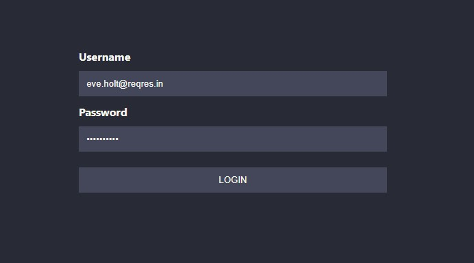

<h1 align="center">React Context Hooks</h1>
<p align="center">
  
</p>
<h2 align="center">Simple page to authentication</h2>

## Hooks that I used

I'm using `useState` and `useContext`. 😄

## Which API did I use to login

I'm using Reqres to create service request test

- Base URL: `https://reqres.in/`
- Endpoint: `/api/login`
- Method request: `POST`

## Library used

- To request API, I'm using `axios`
- To save token data and info user, I'm using `store`
- To style page, I'm using `styled-components`

## How to execute

Clone the repository and install all packages; I'm use command `yarn` or `yarn`.

## How to clone repository

Open your terminal and execute:

```sh
# Clone repository
git clone git@github.com:lenivene/react-auth-hooks-example.git

# After cloning, execute:
cd "./react-auth-hooks-example"

# Install all packages
yarn install #or
npm install
```
